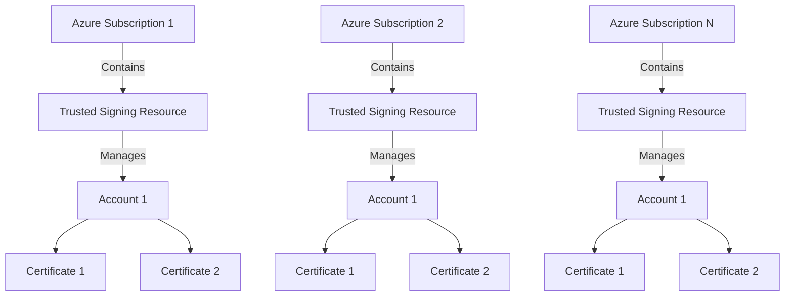

## **Application Overview**  

This is a web service for code signing that utilizes **Azure Trusted Signing**. The service includes an **Admin Panel** for managing signing pages and a **User Page** for file uploads and signing operations. Each page allows to set Azure account with Azure Trusted Signing resource to use certificates for signing.

Each page is defined with Azure Subscription (tenant id), Service Princiapl credentials (Client Id and Client Secret), Account and Certificate in Trusted Signing resource.

## **Core Functionalities**

### **1. Admin Panel**  
The **Admin Panel** is a secured interface accessible via login credentials. Its primary role is to manage and create new user pages for code signing.  

#### **Key Features**  
- **Authentication**:  
  - Admins must log in using a **username and password**.  
  - Authentication will be handled securely, ensuring protection against common vulnerabilities (e.g., SQL injection, brute force).  

- **Create User Pages**:  
  Admins can create new user pages by entering the following details:

  - **Service Principal**:  
    Required to authenticate and authorize the user for accessing Azure services.  
    - **Tenant Id**: The unique identifier for the Azure Active Directory (AAD) tenant.  
    - **Client Id**: The application (client) ID assigned to the service principal.  
    - **Client Secret**: A secret string used to authenticate the service principal.  

  - **Azure Trusted Signing Account**:  
    Required for digitally signing packages or applications in a trusted environment.  
    - **Account name**: The name of the Azure Trusted Signing Account.  
    - **Certificate name**: The certificate used for signing operations.  

  - **User Login and Password**:  
    Credentials for securing the user's individual signing page.  
    - **Username**: The unique identifier for the user.  
    - **Password**: A secure password for authentication.  

  Once these details are entered, the system will generate a dedicated signing page for the user, allowing them to sign and manage their artifacts securely.  

- **Manage Existing Pages**:  
  - View and manage all created pages.  
  - Edit user credentials and page addresses.  
  - Delete user pages if required.  

### **2. User Page**  
Each **User Page** is dynamically generated via the Admin Panel and protected by a unique login and password. This interface allows users to upload files for code signing and download the signed output.

#### **Key Features**  
- **Authentication**:  
  - Users must log in with their assigned credentials to access their dedicated page.  

- **File Upload for Signing**:  
  - Users can upload files for signing with Azure Trusted Signing.  
  - Validation will be performed on file types and sizes (as per Azure's limitations).  

- **Signing Process**:  
  - Once a file is uploaded, the system automatically initiates the signing process using Azure Trusted Signing.  
  - A **progress bar** will visually indicate the file upload and signing status.  

- **Download Signed Files**:  
  - After signing is complete, a **"Download"** button will allow users to download their signed file.  

- **File History Log**:  
  - The page will display a list of all previously uploaded and signed files.  
  - Information for each file will include:  
    - File Name  
    - Upload Date and Time  
    - Signing Status (e.g., pending, completed, failed)  
    - Download Link (if signing is successful)  

### **Database Models**

The system will have the following database tables:  

#### Users Table

   - `id` (Primary Key)  
   - `username` (Unique, required)  
   - `password_hash` (Stored securely using hashing algorithms)  
   - `role` (Admin/User for future scalability)  
   - `created_at` (Timestamp)  

#### Pages Table

The `pages` table stores information about user-specific pages, including their Azure-related credentials and metadata.

##### Columns
- **id** (`Integer`, `Primary Key`, `Indexed`): Unique identifier for each page.
- **user_id** (`Integer`, `ForeignKey("users.id", ondelete="CASCADE")`): Reference to the user who owns the page.
- **username** (`String`, `Unique`, `Nullable`): Optional unique username associated with the page.
- **page_url** (`String`, `Unique`, `Not Null`): The unique URL for the page.
- **azure_account_name** (`String`, `Not Null`): Azure account name associated with the page.
- **azure_certificate_name** (`Text`, `Not Null`): Name of the Azure certificate (should be stored securely, preferably encrypted).
- **azure_tenant_id** (`String`, `Not Null`): Azure tenant ID for authentication.
- **azure_client_id** (`String`, `Not Null`): Azure client ID for authentication.
- **azure_client_secret** (`Text`, `Not Null`): Azure client secret for authentication (should be encrypted for security).
- **created_at** (`DateTime`, `Default: Current Timestamp`): Timestamp when the page was created.
- **updated_at** (`DateTime`, `Default: Current Timestamp`, `Auto-update on modification`): Timestamp of the last update.
- **status** (`String`, `Default: "active"`): Current status of the page (e.g., active, inactive).

#### Files Table

The `files` table stores file metadata, tracking uploaded files, their statuses, and signed versions.

##### Columns
- **id** (`Integer`, `Primary Key`, `Indexed`): Unique identifier for each file.
- **user_id** (`Integer`, `ForeignKey("users.id")`): Reference to the user who uploaded the file.
- **file_name** (`String`, `Not Null`): The name of the uploaded file.
- **file_path** (`String`, `Not Null`): Storage path of the file.
- **status_id** (`Integer`, `ForeignKey("file_statuses.id")`): Reference to the status of the file.
- **status** (`String`, `Default: FILE_STATUS_PENDING`): Status of the file (e.g., pending, signed, verified).
- **signed_file_path** (`String`, `Nullable`): Path to the signed version of the file, if applicable.
- **uploaded_at** (`DateTime`, `Default: Current Timestamp`): Timestamp when the file was uploaded.
- **signed_at** (`DateTime`, `Nullable`): Timestamp when the file was signed.

## **API Endpoints**  
Here’s a simplified overview of essential API routes:  

- **Authentication**  
  - `POST /api/login` - Authenticate user and return a token.  

- **Admin Panel**  
  - `POST /api/pages` - Create a new user page.  
  - `GET /api/pages` - Retrieve all created pages.  
  - `PUT /api/pages/{id}` - Update a specific page's details.  
  - `DELETE /api/pages/{id}` - Delete a page.  

- **User Page**  
  - `POST /api/files/upload` - Upload a file for signing.  
  - `GET /api/files/history` - Retrieve the history of signed files.  
  - `GET /api/files/download/{file_id}` - Download a signed file.  
